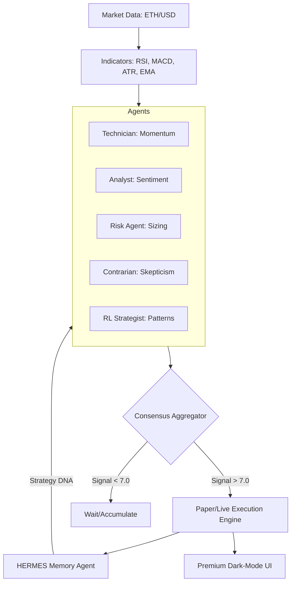

# 🏛️ ATLAS: Autonomous Trading Logic & Advisory System
**Hackathon Edition — The Ultimate AI-Driven Multi-Agent Consensus Engine**

ATLAS is a next-generation, agentic trading ecosystem designed for the crypto markets. Unlike traditional algorithmic bots, ATLAS treats every trade as a **democratic deliberation** between five specialized AI agents. It blends technical precision, sentiment analysis, and machine learning into a single, high-fidelity advisory platform.

---

## 🌌 System Architecture
ATLAS is built on a **Modular Multi-Agent Pipeline**. Every "tick" (30s) triggers a massive parallel analysis:



---

## 🛠️ Tech Stack
| Layer | Technologies |
| :--- | :--- |
| **Brain** | GPT-4o, PPO (Reinforcement Learning), Stable-Baselines3, Alibaba AgentScope |
| **Backend** | Python 3.11+, FastAPI, Uvicorn, Asyncio |
| **Data** | yfinance, CCXT (Binance/Coinbase), Pandas-TA |
| **Frontend** | Vanilla HTML5/CSS3 (Glassmorphism), JavaScript (Real-time Polling) |
| **Storage** | Redis (State Cache) + JSON (Memory Logs) |
| **Logic** | Loguru (Diagnostics), CoPAW (Cron Scheduler) |

---

## 🌊 User Flow: The Investor Experience
1.  **Market Awareness**: The user opens the dashboard at `localhost:8000` to see real-time ETH/USD price action and regime detection (BULL/BEAR/CHOP).
2.  **AI Deliberation**: Observe the **Live Voting Logs**. See exactly why an agent voted for a trade or why the Contrarian killed it.
3.  **Risk Oversight**: Monitor the **Circuit Breaker** status, which auto-halts trading during extreme volatility (VIX spikes).
4.  **Strategic Hindsight**: View **HERMES Post-Mortems**—daily reports that explain what the system learned from its wins and losses.

---

## 🔨 Builder Flow: The Developer Lifecycle
1.  **Configure**: Tweak Agent prompts or RL weights in `core/agents/`.
2.  **Simulate**: Run a 60-day historical backtest using `python tests/test_day6.py`.
3.  **Verify**: Audit the generated HTML performance reports in `simulation/reports/`.
4.  **Deploy**: Launch the live paper-trading loop with `python run_live.py`.
5.  **Evolve**: Use HERMES to bake new "Strategy DNA" back into the agents.

---

## 🏁 Quick Start

### 1. Pull & Install
```bash
# Clone the repository
git clone https://github.com/hihihi-svg/ATLAS.git
cd ATLAS

# Install dependencies
pip install -r requirements.txt
```

### 2. Configure Environment
Create a `.env` file from the example:
```bash
cp .env.example .env
```
*Add your `OPENAI_API_KEY` and `GEMINI_API_KEY` for the full agentic experience.*

### 3. Run the System
```bash
# Start the live trading loop and dashboard
python run_live.py
```
*The system will automatically open your browser to `http://localhost:8000`.*

---

## 📈 How to Use
*   **Live Dashboard**: Monitor the "Decision Panel" for real-time trade signals.
*   **Manual Override**: Use the "Emergency Halt" button if you disagree with the AI's market read.
*   **Performance Audit**: Click "Transformation Story" in the UI to see how ATLAS evolved from a manual strategy to a fully autonomous agent.
*   **Authenticity Check**: Run the test scripts in `tests/` to verify performance against real historical black-swan events.

---

**Built with ❤️ for the Hackathon Edition.**
*"Trading is a game of logic; ATLAS is the ultimate player."*
